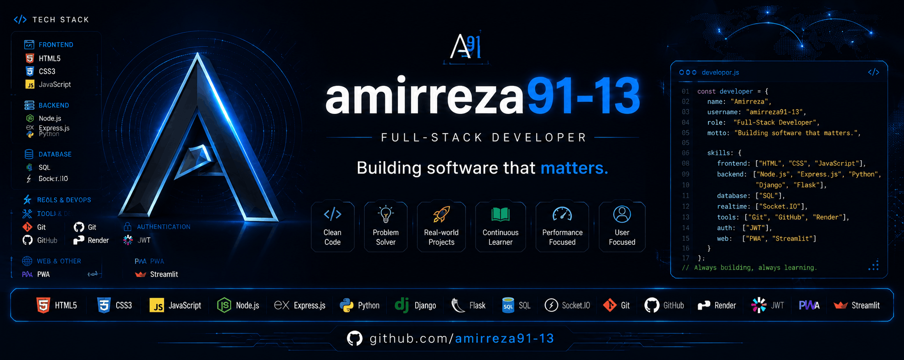

  

<h1 align="center">Hi 👋 I'm Amirreza</h1>

<h3 align="center">
Building software that matters.
</h3>

---

## 🚀 About Me

- 💻 Full-Stack Developer
- 🌱 Always learning new technologies
- ⚡ Passionate about building real-world applications
- 🎯 Currently focused on Backend Development and Modern Web Technologies

---

## 💻 Tech Stack

### 🌐 Frontend

- HTML5
- CSS3
- JavaScript

### ⚙️ Backend

- Node.js
- Express.js
- Python
- Django
- Flask

### 🗄 Database

- SQL

### ⚡ Real-Time

- Socket.IO

### 🔐 Authentication

- JWT

### ☁️ Deployment

- Render

### 🧠 Python

- Streamlit

### 🛠 Tools

- Git
- GitHub
- PWA

---

## ⭐ Featured Project

### 🏠 Mirhaj Real Estate

A full-stack real estate platform featuring authentication, image uploads, responsive UI, PWA support, and real-time capabilities.

🔗 https://github.com/amirreza91-13/mirhaj-realestate

---

## 🌱 Currently Learning

- Advanced Node.js
- Express.js
- Modern JavaScript
- Software Architecture

---

## 📫 Connect with Me

GitHub

https://github.com/amirreza91-13

LinkedIn

(Coming Soon)

X (Twitter)

(Coming Soon)

---

> "Building software that matters."
