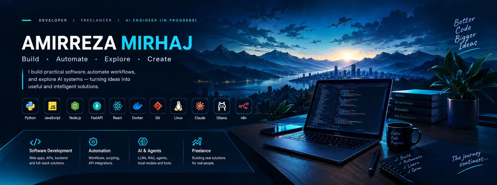

# AMIRREZA MIRHAJ

### Freelancer · Software Developer · Automation Builder

**Building Practical Software. Automating Workflows. Growing Toward AI Engineering.**

I’m a freelancer focused on building practical software solutions, exploring workflow automation, and developing the engineering foundations needed to create useful AI-powered applications.

My approach is simple: understand the problem, build a practical solution, test what works, and keep improving.

[GitHub](https://github.com/amirreza91-13) · [LinkedIn](https://www.linkedin.com/in/amirreza-mirhaj-490250435/) · [Email](mailto:amirreza.91mirhaj@gmail.com)

---

## About Me

I’m developing my career at the intersection of software development, automation, and artificial intelligence.

I’m interested in more than writing code. I want to understand how applications, APIs, databases, and AI tools can work together to solve real problems.

My current priorities are:

* **Software Development:** Building and improving practical applications.
* **Freelancing:** Developing a portfolio around useful, clearly defined digital solutions.
* **Workflow Automation:** Exploring ways to connect services and reduce repetitive work.
* **AI Integration:** Learning how to incorporate language models into software workflows.
* **AI Engineering:** Building a strong technical foundation for more advanced intelligent systems.

I value practical experimentation, honest documentation, and continuous improvement over unsupported claims of expertise.

## Selected Projects

### 01 — Planner

**A local-first personal planning application**

A web application project combining a React and TypeScript frontend with a Python and Django backend.

**Technologies:** React · TypeScript · Vite · Python · Django · SQLite

**Focus areas:** Application architecture, frontend development, backend integration, and personal productivity workflows.

[Explore the repository →](https://github.com/amirreza91-13/planner)

*Status: In development.*

### 02 — DeepSeek API Kit

**Python-based model API integration**

A project exploring an OpenAI-style API proxy and a separate DeepSeek-oriented chat application built with FastAPI.

**Technologies:** Python · FastAPI · REST APIs · JSON

**Focus areas:** API integration, service structure, model connectivity, and chat-session persistence.

[Explore the repository →](https://github.com/amirreza91-13/deepseek-api-kit)

*Status: Experimental; compatibility and security require validation.*

### 03 — Local Coding Assistant

**An experimental coding assistant using local language models**

A Python project exploring local model interaction through Ollama, with a terminal entry point and a Streamlit interface.

**Technologies:** Python · Ollama · Streamlit

**Focus areas:** Local inference, coding-assistant workflows, and conversation-history handling.

[Explore the repository →](https://github.com/amirreza91-13/Local-Coding-Assistant)

*Status: Experimental; interface behavior and core workflows require further testing.*

### 04 — Mirhaj Real Estate

**A web application for real-estate workflows**

A JavaScript-based application project with server-side functionality and components for authentication, database persistence, file handling, and real-time communication.

**Technologies:** JavaScript · Node.js · Express · Socket.IO · sql.js

**Focus areas:** Web application architecture, backend development, data management, and real-estate-related workflows.

[Explore the repository →](https://github.com/amirreza91-13/mirhaj-realestate)

*Status: Development project; production readiness and security require verification.*

---

## Technical Skills

My skills are best understood through three categories: technologies represented in my projects, tools I use during development, and areas I am actively learning.

### Project-Based Technologies

| Area        | Technologies                       |
| ----------- | ---------------------------------- |
| Programming | Python, JavaScript                 |
| Frontend    | React, TypeScript, HTML, CSS, Vite |
| Backend     | Django, FastAPI, Node.js, Express  |
| APIs & Data | REST APIs, JSON, SQLite, sql.js    |
| Development | Git, GitHub, PowerShell            |

These technologies appear in my public projects. Their presence does not imply equal proficiency or professional-level mastery in every tool.

### Development & AI Tools

I explore development assistants, model-access services, and local AI tools to understand how they can support practical software workflows.

My current areas of interest include:

* AI-assisted development
* Language-model API integration
* Local language models and Ollama
* Workflow automation with n8n
* Tool integration and the Model Context Protocol (MCP)

These are learning and experimentation areas unless a specific repository demonstrates a working implementation.

---

## Current Focus

### Software Development

Strengthening programming fundamentals, application structure, API design, and maintainable code.

### Workflow Automation

Learning to connect services into useful, repeatable workflows and exploring practical automation opportunities.

### AI-Powered Applications

Understanding model APIs, application integration, and the components required to build useful AI-enabled tools.

### Engineering Foundations

Improving debugging, testing, documentation, security awareness, and project organization.

---

## My Direction

**Learn → Build → Test → Automate → Improve**

My short-term goal is to develop useful solutions for freelance work and build a credible portfolio through practical projects.

My long-term goal is to grow into AI engineering, combining software development, automation, and intelligent application design.

I intend to document progress through working implementations, clearer project READMEs, and verifiable technical results.

---

## GitHub Activity

*These cards depend on an external service. Language statistics reflect detected repository code, not individual proficiency.*

---

## Let's Connect

I’m interested in practical software projects, workflow automation, and opportunities to learn through building useful solutions.

[Connect on LinkedIn](https://www.linkedin.com/in/amirreza-mirhaj-490250435/)

[Contact by Email](mailto:amirreza.91mirhaj@gmail.com)

---

**Build with purpose. Learn through practice. Improve with every project.**
